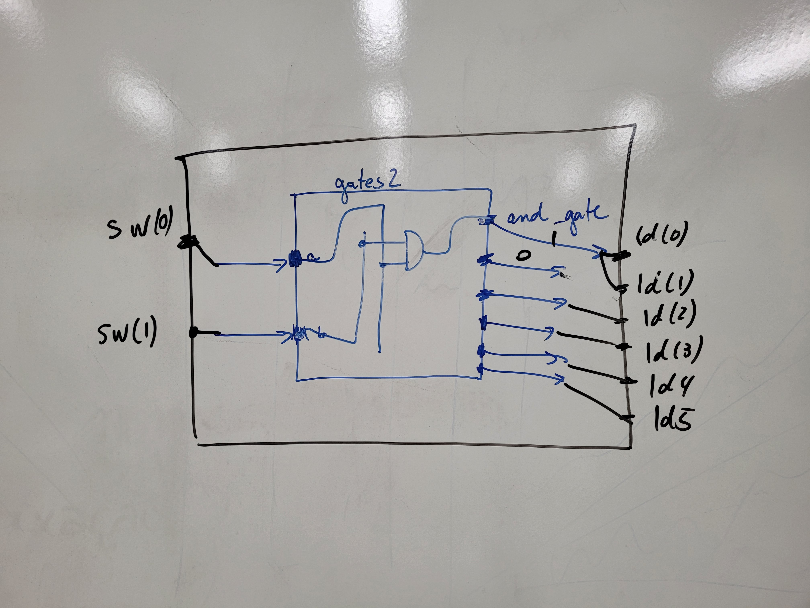
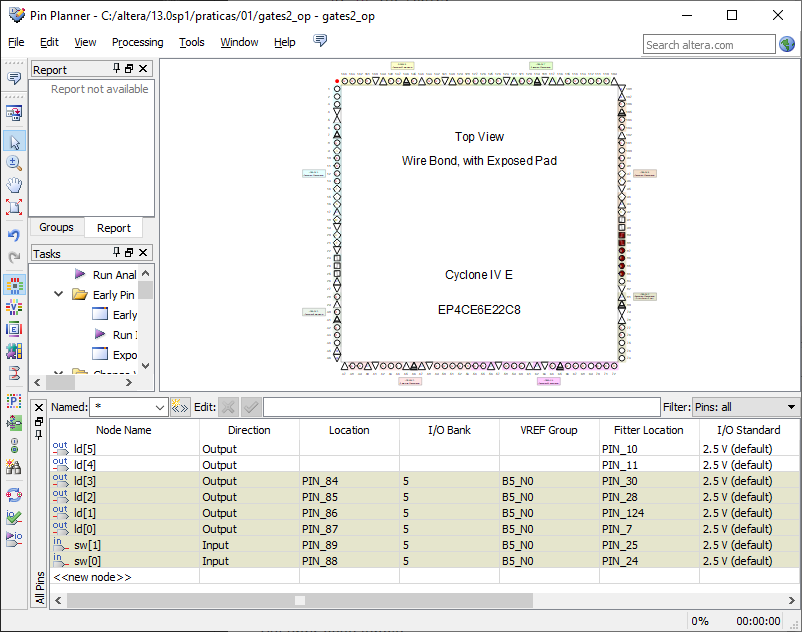

Organização de Computadores, Roteiro da Aula Prática 0, 18 de julho de 2023.

---

**Sumário**

- [Objetivo](#objetivo)
- [Criar projeto](#criar-projeto)
- [Programando em VHDL - gates2](#programando-em-vhdl---gates2)
	- [Criando novo arquivo](#criando-novo-arquivo)
	- [Definindo Entidade](#definindo-entidade)
	- [Definindo Arquitetura](#definindo-arquitetura)
- [Programando em VHDL - gates2\_top](#programando-em-vhdl---gates2_top)
	- [Criando novo arquivo](#criando-novo-arquivo-1)
	- [Definindo Entidade](#definindo-entidade-1)
	- [Definindo Arquitetura](#definindo-arquitetura-1)
- [Arquivos finais](#arquivos-finais)
	- [Arquivo `gates2.vhd`:](#arquivo-gates2vhd)
	- [Arquivo `gates2_top`:](#arquivo-gates2_top)
- [Atribuindo aos leds e sinais de controle aos pinos do Cyclone](#atribuindo-aos-leds-e-sinais-de-controle-aos-pinos-do-cyclone)

## Objetivo

Iremos criar a seguinte arquitetura descrevendo-o em VHDL: 



## Criar projeto

1. Abra a IDE Quartus II
2. Clique em criar novo projeto
3. Selecione o FPGA Cyclone IV E, modelo EP4C6E22C8
4. Nome do projeto: "gates_top"

## Programando em VHDL - gates2

### Criando novo arquivo

`File -> New... -> VHDL File`

Escreva dentro do arquivo :

```VHDL
library IEEE;
use IEEE.std_logic_1164.all;
```

Salve como `gates2.vhd`

### Definindo Entidade

A entidade define as portas de entrada e saída do circuito.  Adicione essas linhas ao arquivo:

```VHDL
entity gates2 is
port (
	a: in STD_LOGIC;
	b: in STD_LOGIC;
	and_gate: out STD_LOGIC;
	nand_gate: out STD_LOGIC;
	or_gate: out STD_LOGIC;
	nor_gate: out STD_LOGIC;
	xor_gate: out STD_LOGIC;
	xnor_gate: out STD_LOGIC
);
end gates2;
```

Salve o arquivo.

### Definindo Arquitetura

A arquitetura dita o comportamento das portas de entrada e saída do circuito. Adicione essas linhas ao arquivo:

```VHDL
architecture gates2 of gates2 is
begin
	and_gate <= b and a;
	nand_gate <= not (b and a);
	or_gate <= b or a;
	nor_gate <= not (b or a);
	xor_gate <= b xor a;
	xnor_gate <= not (b xor a);
end gates2;
```

## Programando em VHDL - gates2_top

### Criando novo arquivo

`File -> New... -> VHDL File`

Escreva no arquivo:

```VHDL
library IEEE;
use IEEE.std_logic_1164.all;
```

Salve como `gates2_top.vhd`. 

### Definindo Entidade

Adicione essas linhas ao arquivo:

```VHDL
entity gates2_top is 
port (
	sw: in STD_LOGIC_VECTOR (1 downto 0);
	ld: out STD_LOGIC_VECTOR (5 downto 0)
);
end gates2_top;
```

### Definindo Arquitetura

```VHDL
architecture gates2_top of gates2_top is 
component gates2
port (
	a: in STD_LOGIC;
	b: in STD_LOGIC;
	and_gate: out STD_LOGIC;
	nand_gate: out STD_LOGIC;
	or_gate: out STD_LOGIC;
	nor_gate: out STD_LOGIC;
	xor_gate: out STD_LOGIC;
	xnor_gate: out STD_LOGIC
);
end component;
begin
U1: gates2 port map (
	a => sw(1),
	b => sw(0),
	and_gate => ld(5),
	nand_gate => ld(4),
	nor_gate => ld(3),
	or_gate => ld(2),
	xnor_gate => ld(1),
	xor_gate => ld(0)
);
end gates2_top;
```

Compilar o código no ícone do play.

## Arquivos finais

### Arquivo `gates2.vhd`:

```VHDL
library IEEE;
use IEEE.std_logic_1164.all;

entity gates2 is
port (
	a: in STD_LOGIC;
	b: in STD_LOGIC;
	and_gate: out STD_LOGIC;
	nand_gate: out STD_LOGIC;
	or_gate: out STD_LOGIC;
	nor_gate: out STD_LOGIC;
	xor_gate: out STD_LOGIC;
	xnor_gate: out STD_LOGIC
);
end gates2;

architecture gates2 of gates2 is
begin
	and_gate <= b and a;
	nand_gate <= not (b and a);
	or_gate <= b or a;
	nor_gate <= not (b or a);
	xor_gate <= b xor a;
	xnor_gate <= not (b xor a);
end gates2;
```

### Arquivo `gates2_top`:

```VHDL
library IEEE;
use IEEE.std_logic_1164.all;

entity gates2_top is 
port (
	sw: in STD_LOGIC_VECTOR (1 downto 0);
	ld: out STD_LOGIC_VECTOR (5 downto 0)
);
end gates2_top;

architecture gates2_top of gates2_top is 
component gates2
port (
	a: in STD_LOGIC;
	b: in STD_LOGIC;
	and_gate: out STD_LOGIC;
	nand_gate: out STD_LOGIC;
	or_gate: out STD_LOGIC;
	nor_gate: out STD_LOGIC;
	xor_gate: out STD_LOGIC;
	xnor_gate: out STD_LOGIC
);
end component;
begin
U1: gates2 port map (
	a => sw(1),
	b => sw(0),
	and_gate => ld(5),
	nand_gate => ld(4),
	nor_gate => ld(3),
	or_gate => ld(2),
	xnor_gate => ld(1),
	xor_gate => ld(0)
);
end gates2_top;
```

## Atribuindo aos leds e sinais de controle aos pinos do Cyclone

Abrindo janela de pin planner em:

`Assignments -> Pin Planner`

Irá exibir esta janela:



Atribuir os leds e os sw aos seguintes pinos, conforme na figura acima:
- ld[3]: PIN_84
- ld[2]: PIN_85
- ld[1]: PIN_86
- ld[0]: PIN_87
- sw[0]: PIN_89
- sw[1]: PIN_88

Compilar novamente.
