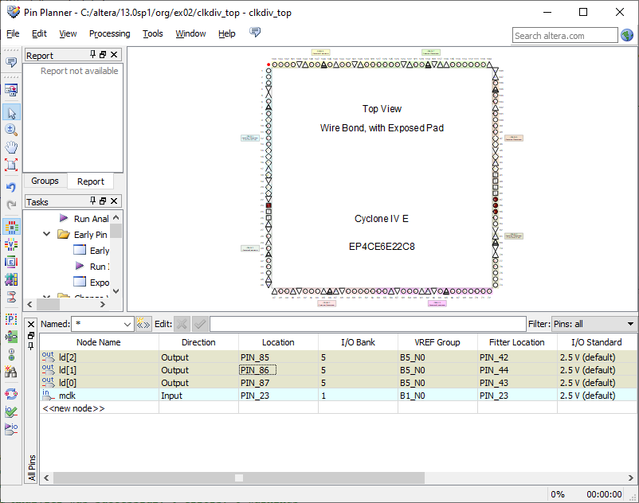

# Organização de computadores

Iremos criar a seguinte arquitetura: 

[TODO: img do exemplo]()

O objetivo é descrever o NEANDER em VHDL e vê-lo funcionando.

### Criar projeto

1. Cyclone IV E
2. EP4C6**E22C8**
3. Nome do projeto: "gates_top"

### Programando em VHDL - gates2

#### Criando novo arquivo

`File -> New... -> VHDL File`

Escreva dentro do arquivo :

```VHDL
library IEEE;
use IEEE.std_logic_1164.all;
```

Salve como `gates2.vhd`

#### Definindo Entidade

A entidade define as portas de entrada e saída do circuito.  Adicione essas linhas ao arquivo:

```VHDL
entity gates2 is
port (
	a: in STD_LOGIC;
	b: in STD_LOGIC;
	and_gate: out STD_LOGIC;
	nand_gate: out STD_LOGIC;
	or_gate: out STD_LOGIC;
	nor_gate: out STD_LOGIC;
	xor_gate: out STD_LOGIC;
	xnor_gate: out STD_LOGIC
);
end gates2;
```

Salve o arquivo.

#### Definindo Arquitetura

A arquitetura dita o comportamento das portas de entrada e saída do circuito. Adicione essas linhas ao arquivo:

```VHDL
architecture gates2 of gates2 is
begin
	and_gate <= b and a;
	nand_gate <= not (b and a);
	or_gate <= b or a;
	nor_gate <= not (b or a);
	xor_gate <= b xor a;
	xnor_gate <= not (b xor a);
end gates2;
```

### Programando em VHDL - gates2_top

#### Criando novo arquivo

`File -> New... -> VHDL File`

Escreva no arquivo:

```VHDL
library IEEE;
use IEEE.std_logic_1164.all;
```

Salve como `gates2_top.vhd`. 

#### Definindo Entidade

Adicione essas linhas ao arquivo:

```VHDL
entity gates2_op is 
port (
	sw: in STD_LOGIC_VECTOR (1 downto 0);
	ld: out STD_LOGIC_VECTOR (5 downto 0)
);
end gates2_op;
```

#### Definindo Arquitetura

```VHDL
architecture gates2_op of gates2_op is 
component gates2
port (
	a: in STD_LOGIC;
	b: in STD_LOGIC;
	and_gate: out STD_LOGIC;
	nand_gate: out STD_LOGIC;
	or_gate: out STD_LOGIC;
	nor_gate: out STD_LOGIC;
	xor_gate: out STD_LOGIC;
	xnor_gate: out STD_LOGIC
);
end component;
begin
U1: gates2 port map (
	a => sw(1),
	b => sw(0),
	and_gate => ld(5),
	nand_gate => ld(4),
	nor_gate => ld(3),
	or_gate => ld(2),
	xnor_gate => ld(1),
	xor_gate => ld(0)
);
end gates2_op;
```

Compilar o código no ícone do play.

#### Arquivos finais

gates2:

```VHDL
library IEEE;
use IEEE.std_logic_1164.all;

entity gates2 is
port (
	a: in STD_LOGIC;
	b: in STD_LOGIC;
	and_gate: out STD_LOGIC;
	nand_gate: out STD_LOGIC;
	or_gate: out STD_LOGIC;
	nor_gate: out STD_LOGIC;
	xor_gate: out STD_LOGIC;
	xnor_gate: out STD_LOGIC
);
end gates2;

architecture gates2 of gates2 is
begin
	and_gate <= b and a;
	nand_gate <= not (b and a);
	or_gate <= b or a;
	nor_gate <= not (b or a);
	xor_gate <= b xor a;
	xnor_gate <= not (b xor a);
end gates2;
````

gates2_top (renomear tudo para gates2_top):

```VHDL
library IEEE;
use IEEE.std_logic_1164.all;

entity gates2_op is 
port (
	sw: in STD_LOGIC_VECTOR (1 downto 0);
	ld: out STD_LOGIC_VECTOR (5 downto 0)
);
end gates2_op;

architecture gates2_op of gates2_op is 
component gates2
port (
	a: in STD_LOGIC;
	b: in STD_LOGIC;
	and_gate: out STD_LOGIC;
	nand_gate: out STD_LOGIC;
	or_gate: out STD_LOGIC;
	nor_gate: out STD_LOGIC;
	xor_gate: out STD_LOGIC;
	xnor_gate: out STD_LOGIC
);
end component;
begin
U1: gates2 port map (
	a => sw(1),
	b => sw(0),
	and_gate => ld(5),
	nand_gate => ld(4),
	nor_gate => ld(3),
	or_gate => ld(2),
	xnor_gate => ld(1),
	xor_gate => ld(0)
);
end gates2_op;
```

### Atribuindo aos leds e sinais de controle aos pinos do Cyclone

Abrindo janela de assignments

`Assignments -> Pin Planner`

Vai abrir essa janela:



Atribuir os leds e os sw aos seguintes pinos:
- ld[3]: PIN_84
- ld[2]: PIN_85
- ld[1]: PIN_86
- ld[0]: PIN_87
- sw[0]: PIN_89
- sw[1]: PIN_88

Compilar novamente.


### Programando o ngc com o SB Blaster

asd
