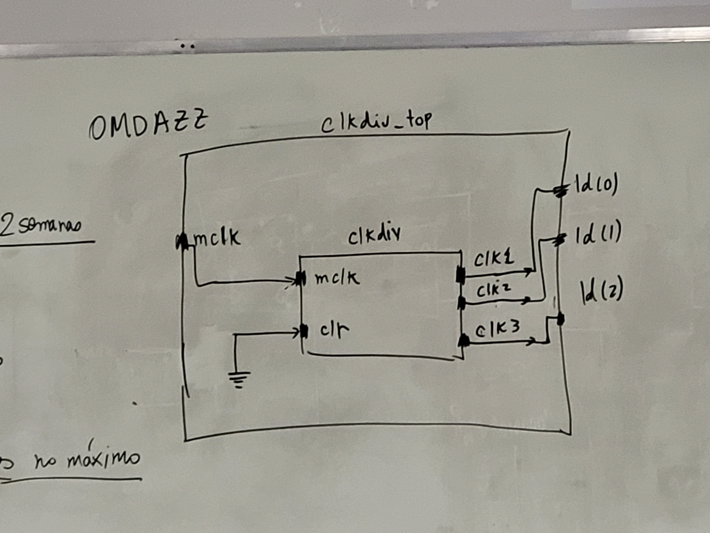
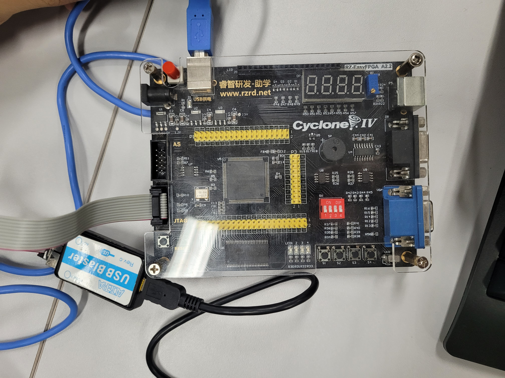
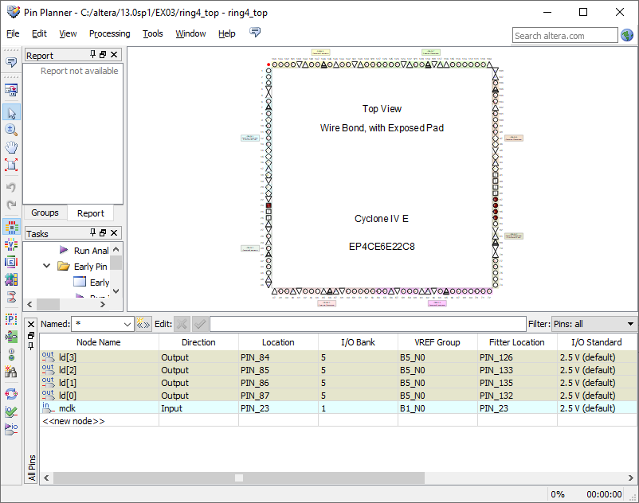
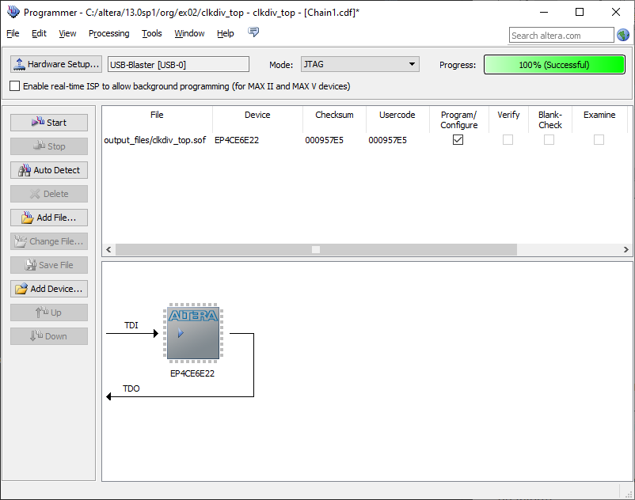

Organização de Computadores, Roteiro da Aula Prática 1, 18 de julho de 2023.

---

**Índice do conteúdo**

- [Objetivo da aula](#objetivo-da-aula)
- [Roteiro da aula prática](#roteiro-da-aula-prática)
	- [Criar projeto](#criar-projeto)
	- [Arquivo `clkdiv.vhd`](#arquivo-clkdivvhd)
		- [Bibliotecas](#bibliotecas)
		- [Entidade](#entidade)
		- [Arquitetura](#arquitetura)
		- [Arquivo final](#arquivo-final)
	- [Arquivo `clkdiv_top.vhd`](#arquivo-clkdiv_topvhd)
		- [Bibliotecas](#bibliotecas-1)
		- [Entidade](#entidade-1)
		- [Componente](#componente)
		- [Arquitetura](#arquitetura-1)
		- [Arquivo final](#arquivo-final-1)
	- [Programando a placa FPGA](#programando-a-placa-fpga)

## Objetivo da aula

Criar a arquitetura do nosso projeto descrevendo-o em VHDL e fazer os LEDs, da saída da placa FPGA, ligar e desligarem.



## Roteiro da aula prática

### Criar projeto

Para criar um projeto, siga o passo a passo:

- Abrir a IDE Quartus II 64-bit.
- File $\to$ New Project Wizard
    - caminho: documentos/org/ex02
    - arquivo: clkdiv_top
- Next
- Selecionar o FGPA: 
  - Família: Cyclone IV E
  - EP4CE6E22C8
- Next
- Finish

Criar arquivo VHDL: File -> New -> VHDL File

### Arquivo `clkdiv.vhd`

#### Bibliotecas

```VHDL
library IEEE;
use IEEE.std_logic_1164.all;
use IEEE.std_logic_unsigned.all;
```

#### Entidade

```VHDL
entity clkdiv is
	port(
		mclk: in std_logic;
		clr: in std_logic;
		clk1: out std_logic;
		clk2: out std_logic;
		clk3: out std_logic
	);

end clkdiv;
```

#### Arquitetura

```VHDL
architecture clkdiv of clkdiv is 
signal q: std_logic_vector (25 downto 0);

begin
-- divisor de clock
	process(mclk, clr)
	begin
		if(clr = '1') then
			-- "00" concatena (&) com "000000". X indica que é um hexadecimal, formando um sinal de 26 bits
			q <= "00" & X"000000";
			else
				-- se ocorrer evento no master clock e estiver em borda de subida
				if mclk'event and mclk = '1' then 
					q <= q + 1;
				end if;
				
			end if;
			
	end process;
	clk1 <= q(23);
	clk2 <= q(24);
	clk3 <= q(25);
end clkdiv;
```

#### Arquivo final

```VHDL
library IEEE;
use IEEE.std_logic_1164.all;
use IEEE.std_logic_unsigned.all;

entity clkdiv is
	port(
		mclk: in std_logic;
		clr: in std_logic;
		clk1: out std_logic;
		clk2: out std_logic;
		clk3: out std_logic
	);

end clkdiv;

architecture clkdiv of clkdiv is 
signal q: std_logic_vector (25 downto 0);

begin
-- divisor de clock
	process(mclk, clr)
	begin
		if(clr = '1') then
			-- "00" concatena (&) com "000000". X indica que é um hexadecimal, formando um sinal de 26 bits
			q <= "00" & X"000000";
			else
				-- se ocorrer evento no master clock e estiver em borda de subida
				if mclk'event and mclk = '1' then 
					q <= q + 1;
				end if;
				
			end if;
			
	end process;
	clk1 <= q(23);
	clk2 <= q(24);
	clk3 <= q(25);
end clkdiv;
```

Salve o arquivo como `clkdiv`.

[Acessar arquivo `clkdiv`.](vhd/clkdiv.vhd)

### Arquivo `clkdiv_top.vhd`

#### Bibliotecas

```VHDL
library IEEE;
use IEEE.std_logic_1164.all;
use IEEE.std_logic_unsigned.all;
```

#### Entidade

```VHDL
entity clkdiv_top is
	port (
		mclk: in std_logic;
		ld: out std_logic_vector (2 downto 0)
	);
end clkdiv_top;
```

#### Componente

```VHDL
component clkdiv
	port (
		mclk: in std_logic;
		clr: in std_logic;
		clk1: out std_logic;
		clk2: out std_logic;
		clk3: out std_logic
	);
end component;
```

#### Arquitetura

```VHDL
architecture clkdiv_top of clkdiv_top is
component clkdiv
	port (
		mclk: in std_logic;
		clr: in std_logic;
		clk1: out std_logic;
		clk2: out std_logic;
		clk3: out std_logic
	);
end component;

begin
	C1: clkdiv port map (
		mclk => mclk,
		clr => '0',
		clk1 => ld(0),
		clk2 => ld(1),
		clk3 => ld(2)
	);
end clkdiv_top;
```

#### Arquivo final

```VHDL
library IEEE;
use IEEE.std_logic_1164.all;
use IEEE.std_logic_unsigned.all;

entity clkdiv_top is
	port (
		mclk: in std_logic;
		ld: out std_logic_vector (2 downto 0)
	);
end clkdiv_top;

architecture clkdiv_top of clkdiv_top is
component clkdiv
	port (
		mclk: in std_logic;
		clr: in std_logic;
		clk1: out std_logic;
		clk2: out std_logic;
		clk3: out std_logic
	);
end component;

begin
	C1: clkdiv port map (
		mclk => mclk,
		clr => '0',
		clk1 => ld(0),
		clk2 => ld(1),
		clk3 => ld(2)
	);
end clkdiv_top;
```

Salve o arquivo como `clkdiv_top`.

[Acessar arquivo `clkdiv_top`.](vhd/clkdiv_top.vhd.vhd)

### Programando a placa FPGA

Essa é a placa Cyclone IV E EP4CE6E22C8



Dentro do simulador Quartus II, assinale os pinos do `mclk` e dos LEDs correspondentes, para isso vá em:

Assignments -> pin planner



Assinale os pinos:
- `ld[2]`: PIN_85
- `ld[1]`: PIN_86
- `ld[0]`: PIN_87
- `mclk`: PIN_23

Compile novamente, abra a janela Programmer, configure e execute da seguinte maneira:

- tools -> programmer
- hardware setup -> USB Blaster
- add file -> /output_file/clkdiv_top.sof
- start



---

Relatório em grupo (Máximo 5 alunos por grupo): fazer contador com divisor de clock, nome da placa OMDAZZ, software da Alterra. 

O relatório deve conter:
1. Objetivo
2. Materiais e Métodos
3. Procedimento Experimental
4. Resultados e conclusão
5. Bibliografia

Prazo de 2 semanas. Nota de relatório entra como nota de trabalho.

Bibliografia: Roberto d'Amore

