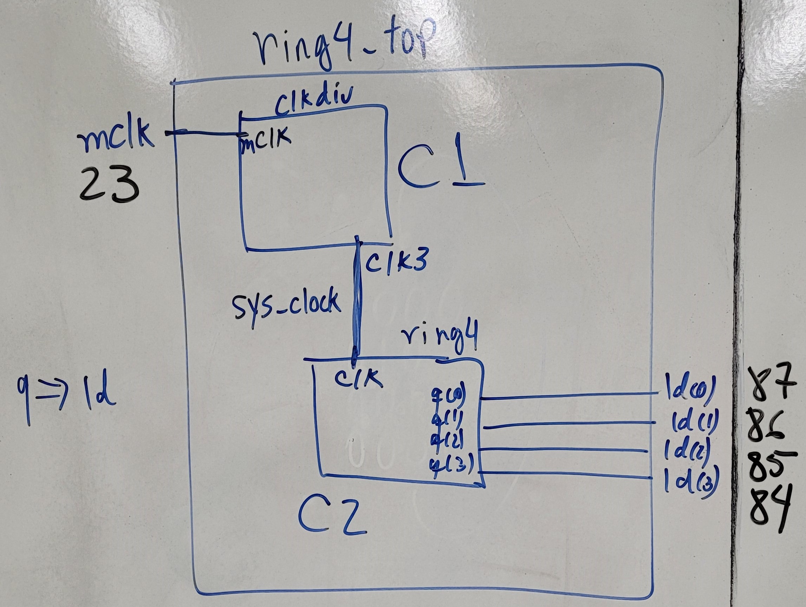
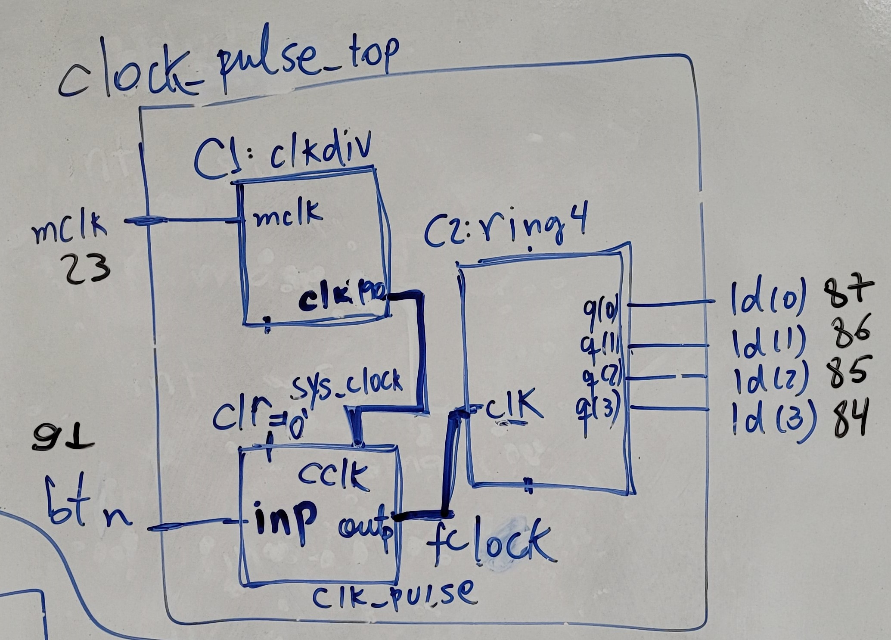
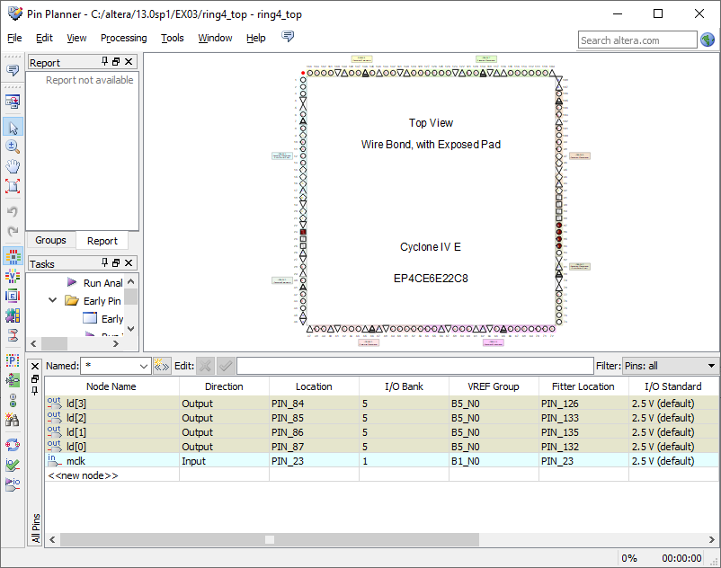

Organização de Computadores, Roteiro da Aula Prática 3, 01 de agosto de 2023.

---

**Sumário**

- [Objetivo da aula](#objetivo-da-aula)
- [Roteiro - Exemplo 1](#roteiro---exemplo-1)
	- [Criar projeto](#criar-projeto)
	- [Arquivo clkdiv](#arquivo-clkdiv)
	- [Arquivo ring4](#arquivo-ring4)
	- [Arquivo ring4\_top](#arquivo-ring4_top)
	- [Programando o FPGA](#programando-o-fpga)
	- [Invertendo a contagem](#invertendo-a-contagem)
- [Roteiro - Exemplo 2](#roteiro---exemplo-2)
	- [Criar projeto](#criar-projeto-1)
	- [Arquivo clock\_pulse\_top](#arquivo-clock_pulse_top)
	- [Programando o FPGA](#programando-o-fpga-1)
- [Arquivos finais disponibilizados](#arquivos-finais-disponibilizados)
	- [Exemplo 1](#exemplo-1)
		- [Arquivo clkdiv](#arquivo-clkdiv-1)
		- [Arquivo ring4](#arquivo-ring4-1)
		- [Arquivo ring4\_top](#arquivo-ring4_top-1)
	- [Exemplo 2](#exemplo-2)
		- [clock\_pulse](#clock_pulse)
		- [clock\_pulse\_top](#clock_pulse_top)

## Objetivo da aula

Implementar um contador em anel de 4 bits: ring4_top.



Para fins de debuggar um processador neander, implementar um filtro de clock e poder conferir os resultados do processador para cada clock.



## Roteiro - Exemplo 1

### Criar projeto

- New project wizard
- Selecione uma pasta .../ex03
- O nome do projeto é: `ring4_top`
- Clique em Next
- Selecione a família Cyclone IV E, especificamente o FPGA EP4CE6E22C8.
- Clique em Next
- Finish

### Arquivo clkdiv

Clkdiv será os nossos clocks.

New... -> VHDL File -> nome: clkdiv

Adicione esse código ao arquivo.

```VHDL
library IEEE;
use IEEE.std_logic_1164.all;
use IEEE.std_logic_unsigned.all;

entity clkdiv is
	port(
		mclk: in std_logic; -- master clock
		clr: in std_logic; -- clear
		clk25: out std_logic; -- clock 25 MHz
		clk90: out std_logic; -- clock 190 kHz
		clk3: out std_logic; -- clock 3 Hz
	);
end clkdiv;

architecture clkdiv of clkdiv is
signal q: std_logic_vector (23 downto 0);

begin
	-- clock divider (quando mclk ou clr mudar o process sera acionado)
	process (mclk, clr)
	begin
		if (clr = "1") then
			q <= X"000000"; -- 000000 em Hexadecimal, cada letra em hexa sao 4 bits
		else
			if mclk'event and mclk = "1" then
				q <= q + 1
			end if;
		end if;
	end process;
	
	clk25 <= q(0); -- dividir por 2
	clk190 <= q(17); -- dividir por 2^18
	clk3 <= q(23);
	
end clkdiv;
```

### Arquivo ring4

Ring4 será o nosso contador em anel de 4 bits.

New... -> VHDL File -> nome: ring4

Adicione esse código ao arquivo.

```VHDL
library IEEE;
use IEEE.std_logic_1164.all;
use IEEE.std_logic_unsigned.all;

entity ring4 is
	port (
		clk: in std_logic;
		clr: in std_logic;
		q: out std_logic_vector (3 downto 0);
	);

end ring4;

architecture ring4 of ring4 is
signal qs: std_logic_vector (3 downto 0);

begin
	process (clk, clr)
	begin
		if clr = "1" then
			qs <= "0001";
		elsif clk'event and clk = '1' then
			case qs is
				when "0001" => qs <= "0010"; -- quando qs for 0001, ele vai ser 0010
				when "0010" => qs <= "0100";
				when "0100" => qs <= "1000";
				when "1000" => qs <= "0001";
				when others => qs <= "0001"; -- quando der outros casos, entao qs = 0001
			end case;
		end if;
	end process;
	
	q <= qs;
end ring4;
```

### Arquivo ring4_top

Ring4_top será o nosso contador em anel de 4 bits.

New... -> VHDL File -> nome: ring4

Adicione esse código ao arquivo.

```VHDL
library IEEE;
use IEEE.std_logic_1164.all;
use IEEE.std_logic_unsigned.all;

entity ring4_top is
	port (
		mclk: in std_logic;
		ld: out std_logic_vector (3 downto 0); 
	);
	
end ring4_top;

architecture ring4_top of ring4_top is
component clkdiv
	port(
		mclk: in std_logic; -- master clock
		clr: in std_logic; -- clear
		clk25: out std_logic; -- clock 25 MHz
		clk90: out std_logic; -- clock 190 kHz
		clk3: out std_logic; -- clock 3 Hz
	);
end component;

component ring4
	port (
		clk: in std_logic;
		clr: in std_logic;
		q: out std_logic_vector (3 downto 0);
	);
end component;

signal sys_clock: std_logic;

begin
	C1: clkdiv port map (
		mclk => mclk, -- mclk do FPGA será ligado ou clkdiv
		clr => "0",
		clk3 => sys_clock -- clock de 3 Hz pra excitar o anel
	);
	
	C2: ring4 port map (
		clk => sys_clock,
		clr => "0",
		q => ld
	);

end ring4_top;
```

Compile e execute o código.

### Programando o FPGA

Abrir a janela de Assignments -> Pin Planner e configurar os pinos da seguinte maneira:

- ld(3): 84
- ld(2): 85
- ld(1): 86
- ld(0): 87
- mclk: 23

Compilar novamente.



Com as entradas USBs do FPGA conectados ao computador, abrir a janela de Tools -> Programmer, selecionar os arquivos output e executar.


### Invertendo a contagem

No arquivo ring4_top.vhd

```VHDL
library IEEE;
use IEEE.std_logic_1164.all;
use IEEE.std_logic_unsigned.all;

entity ring4_top is
  port (
      mclk: in std_logic;  
      ld : out std_logic_vector (3 downto 0)
  );
end ring4_top;


architecture ring4_top of ring4_top is 
component clkdiv
  port(
	   mclk: in std_logic;
		clr: in std_logic;
	   clk25: out std_logic; -- 25 MHz
		clk190: out std_logic; -- 190 kHz
		clk3: out std_logic   -- 3Hz
	);
end component;
component ring4 
 port (
      clk: in std_logic;
		clr: in std_logic;
		q:  out  std_logic_vector (3 downto 0)
  );
end component;
signal sys_clock: std_logic;
signal invq: std_logic_vector (3 downto 0);

begin
  C1: clkdiv port map (
     mclk => mclk, 
	  clr => '0',
	  clk3 => sys_clock
  );
  
  C2: ring4 port map (
     clk => sys_clock,
     clr => '0',
     q => invq
  );
  ld <= not invq;

end ring4_top;
```


## Roteiro - Exemplo 2

### Criar projeto

- Novo Projeto: clock_pulse_top
- Adicionar os arquivos:
  - clock_pulse
  - clkdiv
  - ring4
- FPGA: Cyclone IV E, EP4CE6E22C8
- Finish

### Arquivo clock_pulse_top

```VHDL
library IEEE;
use IEEE.std_logic_1164.all;

entity clock_pulse_top is 
	port (
		mclk: in std_logic;
		btn: in std_logic;
		ld: out std_logic_vector (3 downto 0)
	);
	
end clock_pulse_top;

architecture clock_pulse_top of clock_pulse_top is
component clkdiv is
	port(
	   mclk: in std_logic;
		clr: in std_logic;
	   clk25: out std_logic; -- 25 MHz
		clk190: out std_logic; -- 190 kHz
		clk3: out std_logic   -- 3Hz
	);
end component;

component clock_pulse is
	port (
    inp: in std_logic;
	 cclk: in std_logic;
	 clr: in std_logic;
    outp: out std_logic
end component;

component ring4 is 
	port (
      clk: in std_logic;
		clr: in std_logic;
		q:  out  std_logic_vector (3 downto 0)
  );
end component;

signal sys_clock: std_logic;
signal fclock: std_logic;
signal invq: std_logic_vector (3 downto 0); -- inverter os leds

begin 
	C1: clkdiv port map (
		mclk => mclk,
		clr => '0',
		clk190 => sys_clock
	);
	
	C2: clock_pulse port map (
		inp => btn,
		clr => '0',
		cclk => sys_clock,
		outp => fclock
	);
	
	C3: ring4 port map (
		clk => fclock,
		clr => '0',
		q => invq
	);
	ld <= not invq;
	
end clock_pulse_top;
```

### Programando o FPGA

Abrir a janela de Assignments -> Pin Planner e configurar os pinos da seguinte maneira:
 
- ld(3): 84
- ld(2): 85
- ld(1): 86
- ld(0): 87
- mclk: 23
- btn: 91

Compilar novamente o projeto.

Com as entradas USBs do FPGA conectados ao computador, abrir a janela de Tools -> Programmer, selecionar os arquivos output e executar.


## Arquivos finais disponibilizados

### Exemplo 1

#### Arquivo clkdiv

```VHDL
library IEEE;
use IEEE.std_logic_1164.all;
use IEEE.std_logic_unsigned.all;

entity clkdiv is
   port(
	   mclk: in std_logic;
		clr: in std_logic;
	   clk25: out std_logic; -- 25 MHz
		clk190: out std_logic; -- 190 kHz
		clk3: out std_logic   -- 3Hz
	);
end clkdiv;

architecture clkdiv of clkdiv is 
signal q: std_logic_vector (23 downto 0);
begin
   -- clock divider
	process (mclk , clr )
	begin
	  if (clr = '1') then
	      q <= X"000000";
	  else
	     if mclk'event and mclk = '1' then
		     q <= q+1;
	     end if;
	  end if;
	end process;
	clk25 <= q(0);
	clk190 <= q(17);
	clk3 <= q(23);
end clkdiv ;
```

#### Arquivo ring4

```VHDL
library IEEE;
use IEEE.std_logic_1164.all;
use IEEE.std_logic_unsigned.all;

entity ring4 is 
  port (
      clk: in std_logic;
		clr: in std_logic;
		q:  out  std_logic_vector (3 downto 0)
  );
end ring4;

architecture ring4 of ring4 is
signal qs: std_logic_vector (3 downto 0);
begin
    process (clk, clr)
	 begin
	    if clr = '1' then 
		   qs <= "0001";
		 elsif clk'event and clk = '1' then
		    case qs is
			    when "0001" => qs <= "0010";
				 when "0010"  => qs <= "0100";
				 when "0100"  => qs <= "1000";
				 when "1000"  => qs <= "0001";
				 when others => qs <= "0001";
			 end case;
		 end if;
	 end process;
	 q <= qs;
end ring4;
```

#### Arquivo ring4_top

```VHDL
library IEEE;
use IEEE.std_logic_1164.all;
use IEEE.std_logic_unsigned.all;

entity ring4_top is
  port (
      mclk: in std_logic;  
      ld : out std_logic_vector (3 downto 0)
  );
end ring4_top;


architecture ring4_top of ring4_top is 
component clkdiv
  port(
	   mclk: in std_logic;
		clr: in std_logic;
	   clk25: out std_logic; -- 25 MHz
		clk190: out std_logic; -- 190 kHz
		clk3: out std_logic   -- 3Hz
	);
end component;
component ring4 
 port (
      clk: in std_logic;
		clr: in std_logic;
		q:  out  std_logic_vector (3 downto 0)
  );
end component;
signal sys_clock: std_logic;
begin
  C1: clkdiv port map (
     mclk => mclk, 
	  clr => '0',
	  clk3 => sys_clock
  );
  
  C2: ring4 port map (
     clk => sys_clock,
     clr => '0',
     q => ld
  );

end ring4_top;
```

### Exemplo 2

#### clock_pulse

```VHDL
library IEEE;
use IEEE.std_logic_1164.all;

entity clock_pulse is
  port (
    inp: in std_logic;
	 cclk: in std_logic;
	 clr: in std_logic;
    outp: out std_logic
  );

end clock_pulse;

architecture clock_pulse of clock_pulse is
signal delay1, delay2, delay3 : std_logic;
begin 
    process (cclk , clr)
	 begin 
	     if (clr = '1') then
		     delay1 <= '0';
			  delay2 <= '0';
			  delay3 <= '0';
		  elsif cclk'event and cclk = '1' then
		     delay1 <= inp;
			  delay2 <= delay1;
			  delay3 <= delay2;
		  end if;
	end process;
	outp <= delay1 and delay2 and delay3 ;
end clock_pulse;
```

#### clock_pulse_top

Antes de copiar e colar o código abaixo, é preciso importar/adicionar outros códigos VHDL. Essa etapa é realizada durante a criação do projeto (New Project Wizard). Os códigos que são necessários importar são:

- clkdiv
- clock_pulse
- ring4

```VHDL
library IEEE;
use IEEE.std_logic_1164.all;

entity clock_pulse_top is
  port (
   mclk: in std_logic;
	btn: in std_logic;
	ld: out std_logic_vector (3 downto 0)
  );
end clock_pulse_top;

architecture clock_pulse_top of clock_pulse_top is
component clkdiv is
 port (
     mclk: in std_logic;
	  clr: in std_logic;
	  clk25: out std_logic;
	  clk190: out std_logic;
	  clk3: out std_logic
  );
end component;
component clock_pulse is
 port (
    inp: in std_logic;
	 cclk: in std_logic;
	 clr: in std_logic;
    outp: out std_logic
  );
end component;

component ring4 is
port(
    clk: in std_logic;
	 clr: in std_logic;
    q: out std_logic_vector (3 downto 0)
  );
end component;


signal sys_clock: std_logic;
signal fclock: std_logic;
signal invq: std_logic_vector (3 downto 0);
begin
   C1: clkdiv port map (
	   mclk => mclk, 
		clr =>'0',
		clk190 => sys_clock
	);
	
	C2: clock_pulse port map (
	   inp => btn, 
		clr => '0',
		cclk => sys_clock,
		outp => fclock 
	);
	
	C3: ring4 port map (
	  clk => fclock,
	  clr => '0',
	  q => invq
	);
   ld <= not invq;

end clock_pulse_top;
```