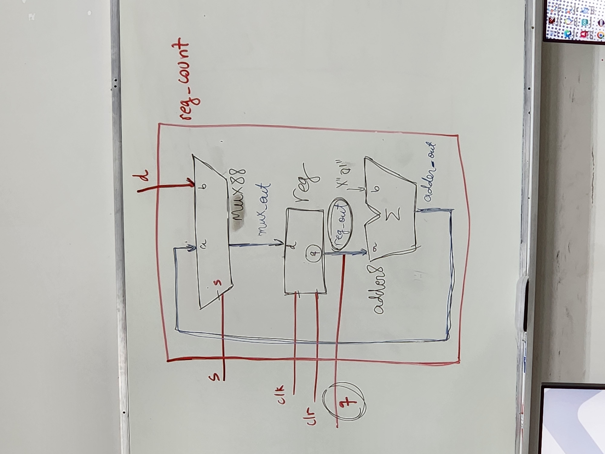

Organização de Computadores, Roteiro da Aula Prática 4, 22 de agosto de 2023.

---

**Sumário**

- [Objetivo da aula](#objetivo-da-aula)
- [Roteiro 1](#roteiro-1)
	- [Criar projeto](#criar-projeto)
	- [Arquivo adder8](#arquivo-adder8)
	- [Arquivo mux88](#arquivo-mux88)
	- [Arquivo reg](#arquivo-reg)
	- [Arquivo reg\_count](#arquivo-reg_count)


## Objetivo da aula

Implementar um circuito que funciona como um contador síncrono de 8 bits, utilizando somador (adder8), um registrador (reg), e um multiplexador (mux88) interconectados de acordo com a lógica especificada na imagem abaixo.

[](imgs/circuito.jpg)

## Roteiro 1

### Criar projeto

- New project wizard
- Selecione uma pasta .../ex04
- O nome do projeto é: `reg_count`
- Clique em Next
- Selecione qualquer FPGA, pois não faremos o uso de alguma placa em específica.
- Clique em Next
- Finish

### Arquivo adder8

Este código VHDL define uma entidade chamada adder8 que implementa um somador de 8 bits. Sempre que os valores nas entradas a ou b mudam, o somador é acionado, e o resultado é colocado na saída s.

A entidade adder8 é declarada com duas entradas (a e b) e uma saída (s). As entradas a e b são vetores de 8 bits, enquanto a saída s também é um vetor de 8 bits. Isso significa que este somador é projetado para somar dois números de 8 bits e produzir uma saída de 8 bits.

Dentro da arquitetura, há um bloco de processo (process) que é sensível às mudanças nos sinais de entrada a e b. Isso significa que sempre que os valores de a ou b mudarem, o bloco de processo será executado.

```VHDL
library IEEE;
use IEEE.std_logic_1164.all;
use IEEE.std_logic_arith.all;
use IEEE.std_logic_unsigned.all;

entity adder8 is 
	port (
		a,b: in std_logic_vector(7 downto 0);
		s: out std_logic_vector(7 downto 0)
	);
end adder8;

architecture behavioral of adder8 is
begin
	process (a,b)
	variable temp: std_logic_vector (7 downto 0);
	
	begin
		temp := a + b;
		s <= temp;
	end process;
end behavioral;
```

### Arquivo mux88

Este código VHDL descreve um multiplexador 8x8 que seleciona entre duas entradas de 8 bits (a e b) com base no valor do sinal de controle s. Dependendo do valor de s, a saída y será igual a a, b ou zero.

A entidade mux88 é declarada com três portas: s, a, b e y.

- s é uma entrada de um único bit e atua como o sinal de controle que determina qual dos dois vetores de 8 bits (a ou b) será selecionado.
- a e b são entradas, cada uma sendo um vetor de 8 bits.
- y é a saída, também um vetor de 8 bits. Esta é a saída que receberá o valor selecionado com base em s.

Dentro da arquitetura, há um bloco de processo (process) que é sensível às mudanças nos sinais de entrada s, a e b. Isso significa que sempre que qualquer um desses sinais mudar, o bloco de processo será executado.

Dentro do bloco de processo, há uma estrutura case que avalia o valor de s.

- Ramo when '0': Se s for igual a '0', o vetor a é atribuído à saída y. Isso significa que a entrada a é selecionada quando s é igual a '0'.
- Ramo when '1': Se s for igual a '1', o vetor b é atribuído à saída y. Isso significa que a entrada b é selecionada quando s é igual a '1'.
- Ramo when others: Se s não for igual a '0' nem '1', o valor X"00" (que representa um vetor de 8 bits com todos os bits em zero) é atribuído à saída y. Isso atua como uma cláusula "default" e garante que, caso s tenha um valor diferente de '0' ou '1', a saída y seja definida como zero.

```VHDL
library IEEE;
use IEEE.std_logic_1164.all;

entity mux88 is 
	port (
		s: in std_logic;
		a, b: in std_logic_vector (7 downto 0);
		y: out std_logic_vector(7 downto 0)
	);
end mux88;

architecture mux88 of mux88 is
begin
	process (s, a, b)
	begin
		case s is 
			when '0' => y <= a; -- caso s seja igual a 0, y recebe a.
			when '1' => y <= b;
			when others => y <= X"00"; -- y sera 0.
			end case;
	end process;
end mux88;
```

### Arquivo reg

Este código VHDL descreve um registrador de 8 bits que pode ser sincronizado por um sinal de clock (clk). Quando o sinal de reset assíncrono (clr) é igual a '1', o registrador é resetado para zero. Caso contrário, na borda de subida do sinal de clock (clk), os dados presentes na entrada d são carregados para a saída q, armazenando assim os dados no registrador.

A entidade reg é declarada com quatro portas:

- **clk** é uma entrada que representa o sinal de clock que sincroniza a operação do registrador.
- **clr** é uma entrada que representa o sinal de reset assíncrono. Quando clr é igual a '1', o registrador é resetado.
- **d** é uma entrada que é um vetor de 8 bits e representa os dados que serão armazenados no registrador.
- **q** é uma saída que é um vetor de 8 bits e representa os dados armazenados no registrador.

Dentro da arquitetura, há um bloco de processo (process) que é sensível às mudanças nos sinais de entrada clr e clk. Isso significa que o registrador irá reagir a mudanças nesses sinais.

Dentro do bloco de processo, há duas condicionais if aninhadas:

- A primeira condicional verifica o sinal clr. Se clr for igual a '1', o registrador é resetado, o que significa que a saída q é configurada para zero (usando a linha comentada q <= X"00"; ou q <= (others => '0');).
- A segunda condicional verifica se ocorreu uma borda de subida (clk'event) no sinal de clock (clk) quando clk é igual a '1'. Se ambas as condições forem verdadeiras, ou seja, o registrador não está em estado de reset (clr não é igual a '1') e ocorreu uma borda de subida no sinal de clock, os dados na entrada d são transferidos para a saída q. Isso representa a operação de carregamento dos dados no registrador em resposta ao sinal de clock.

```VHDL
library IEEE;
use IEEE.std_logic_1164.all;

entity reg is 
	port (
		clk: in std_logic;
		clr: in std_logic;
		d: in std_logic_vector (7 downto 0);
		q: out std_logic_vector (7 downto 0)
	);
end reg;

architecture reg of reg is 
begin
	process (clr, clk)
	begin
		if (clr = '1') then
			-- q <= X"00";
			q <= (others => '0');
		else
			if (clk'event and clk = '1') then
				q <= d;
			end if;
		end if;
	end process;
end reg;
```

### Arquivo reg_count

Este código VHDL descreve um circuito que consiste em um contador síncrono de 8 bits com uma entrada de dados (d), uma saída de dados (q), um sinal de controle (s), um sinal de reset assíncrono (clr) e um sinal de clock (clk).

Dentro da arquitetura, três sinais (**adder_out**, **reg_out**, e **mux_out**) são declarados. Esses sinais são usados para interconectar os componentes do circuito.

Três componentes são declarados, cada um representando um bloco funcional diferente criados anteriormente:

- adder8: Representa um somador de 8 bits. Esse componente adiciona **reg_out** e a constante hexadecimal X"01" e coloca o resultado em **adder_out**.
- mux88: Representa um multiplexador 8x8. Ele seleciona entre os sinais d e **adder_out** com base no sinal de controle s e coloca o resultado em **mux_out**.
- reg: Representa um registrador de 8 bits. Ele armazena o valor de **mux_out** em **reg_out**.

As portas dos componentes são atribuídas aos sinais e aos sinais das portas da entidade reg_count nas seções a seguir:

- ADDER: O componente adder8 é mapeado para as portas **a**, **b** e **s**, onde **a** recebe reg_out, **b** recebe a constante X"01", e **s** recebe **adder_out**.
- MREG: O componente reg é mapeado para as portas **clk**, **clr**, **d**, e **q**, onde **clk** recebe **clk**, **clr** recebe '0', **d** recebe **mux_out**, e **q** recebe **reg_out**.
- MUX: O componente mux88 é mapeado para as portas **s**, **a**, **b**, e **y**, onde **s** recebe **s**, **a** recebe **adder_out**, **b** recebe **d**, e **y** recebe **mux_out**.

```VHDL
library IEEE;
use IEEE.std_logic_1164.all;
use IEEE.std_logic_arith.all;
use IEEE.std_logic_unsigned.all;

entity reg_count is 
	port (
		d: in std_logic_vector(7 downto 0);
		q: out std_logic_vector(7 downto 0);
		s: in std_logic;
		clr, clk: in std_logic
	);
end reg_count;

architecture structural of reg_count is
	signal adder_out: std_logic_vector(7 downto 0);
	signal reg_out: std_logic_vector(7 downto 0);
	signal mux_out: std_logic_vector(7 downto 0);
	
	component adder8
	port (
		a,b: in std_logic_vector(7 downto 0);
		s: out std_logic_vector(7 downto 0)
	);
	end component;
	
	component reg
	port (
		clk: in std_logic;
		clr: in std_logic;
		d: in std_logic_vector (7 downto 0);
		q: out std_logic_vector (7 downto 0)
	);
	end component;
	
	component mux88
	port (
		s: in std_logic;
		a, b: in std_logic_vector (7 downto 0);
		y: out std_logic_vector(7 downto 0)
	);	
	end component;
	
	begin
		ADDER: adder8 port map (
			a => reg_out,
			b => X"01", -- 01 em hexadecimal
			s => adder_out
		);
		
		MREG: reg port map (
			clk => clk,
			clr => '0',
			d => mux_out,
			q => reg_out
		);
		
		MUX: mux88 port map (
			s => s,
			a => adder_out,
			b => d,
			y => mux_out
		);
		
		q <= reg_out;
end structural;
```

Obs.: O relatório dessa aula é até apenas essa parte. Daqui pra frente é outra história.

<!-- ## Roteiro 2

Display de 7 segmentos varia de A até G, todos os segmentos dos displays estão ligados no mesmo pino do FPGA, são segmentos de anôdo. Para os dois displays funcionarem é necessário fazer a troca de padrão entre os displays muito rápido.

###  -->