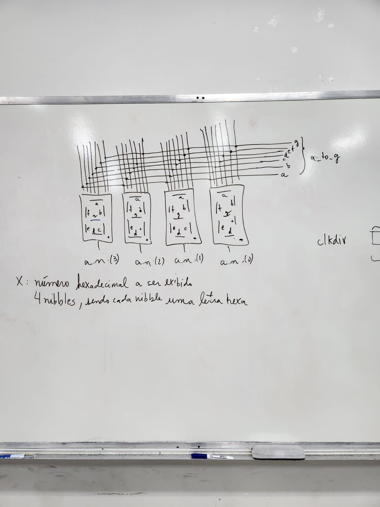
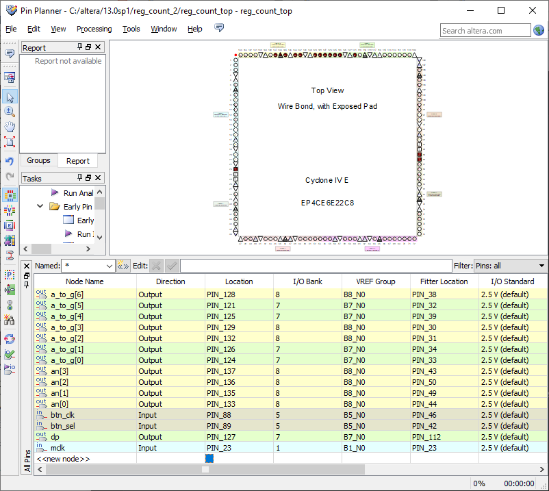

Organização de Computadores, Roteiro da Aula Prática 5, 29 de agosto de 2023.

---

**Sumário**

- [Objetivo da aula](#objetivo-da-aula)
- [Roteiro](#roteiro)
	- [Criar projeto](#criar-projeto)
	- [Arquivo x7seg](#arquivo-x7seg)
	- [Arquivo x7seg\_top](#arquivo-x7seg_top)
	- [Pin planner](#pin-planner)

## Objetivo da aula

Criar um contador em anel com divisor de clock e integrar junto com display de 7 segmentos.

Display de 7 segmentos com divisor de clock.

Implementar um módulo VHDL para exibir números hexadecimais em um display de sete segmentos de quatro dígitos.

[](imgs/x7seg.jpeg)

## Roteiro

### Criar projeto

- New project wizard
- Selecione uma pasta .../ex05
- O nome do projeto é: `x7seg_top`
- Clique em Next
- Selecione o FPGA Cyclone VI E, modelo EP4CE6E22C8
- Clique em Next
- Finish

### Arquivo x7seg

O arquivo x7seg implementa um controlador para exibir números hexadecimais em um display de sete segmentos de quatro dígitos. Ele divide o sinal de clock principal, controla a seleção dos dígitos, traduz os dígitos em códigos de segmentos e controla os ânodos dos dígitos. O resultado é a exibição de números hexadecimais no display de sete segmentos.

A entidade x7seg é declarada com várias portas de entrada e saída.

- **x** é uma entrada de 16 bits que representa os números a serem exibidos no display.
- **clk** é uma entrada que representa o sinal de clock.
- **clr** é uma entrada que representa o sinal de reset.
- **a_to_g** é uma saída de 7 bits que representa os segmentos do display de sete segmentos.
- **an** é uma saída de 4 bits que representa os ânodos do display (cada um controla um dígito).
- **dp** é uma saída de 1 bit que controla o ponto decimal.

Vários sinais internos são declarados para auxiliar na lógica do funcionamento do display.

- **clkdiv** é um sinal de 20 bits usado para dividir o sinal de clock principal em duas partes para sincronização.
- **s** é um sinal de 2 bits que representa o estado do contador.
- **aen** é um sinal de 4 bits que controla os ânodos dos dígitos.
- **digit** é um sinal de 4 bits que armazena os dígitos a serem exibidos.

Um processo é usado para selecionar os dígitos a serem exibidos no display de sete segmentos com base no valor de **s**. Isso é feito através de uma instrução **case**.

Outro processo é usado para traduzir os valores dos dígitos armazenados em **digit** nos códigos de segmentos correspondentes para o display de sete segmentos. Isso é feito através de outra instrução **case**.

Um processo é usado para selecionar os ânodos dos dígitos acesos com base no valor de **s** e **aen**. Ele garante que apenas um dígito seja aceso por vez.

Um processo é usado para dividir o sinal de clock principal em **clkdiv**. Isso é usado para sincronizar várias operações dentro do módulo.

```VHDL
library IEEE;
use IEEE.std_logic_1164.all;
use IEEE.std_logic_unsigned.all;

entity x7seg is
	port (
		x: in std_logic_vector(15 downto 0);
		clk: in std_logic;
		clr: in std_logic;
		a_to_g: out std_logic_vector(6 downto 0); -- a até g
		an: out std_logic_vector(3 downto 0); -- anodos
		dp: out std_logic 								-- ponto decimal
	);
end x7seg;

architecture x7seg of x7seg is
signal clkdiv: std_logic_vector(19 downto 0);
signal s: std_logic_vector(1 downto 0);
signal aen: std_logic_vector(3 downto 0);	
signal digit: std_logic_vector(3 downto 0); -- vai guardar os digitos

begin
	s <= clkdiv(19 downto 18);
	aen <= "1111"; -- tudo ligado
	dp <= '1';
	
	process (x, s)
	begin
		case s is
			when "00" => digit <= x(3 downto 0); -- quando digit for igual a 00, então x recebe 3 downto 0
			when "01" => digit <= x(7 downto 4);
			when "10" => digit <= x(11 downto 8);
			when others => digit <= x(15 downto 12);
		end case;
	end process;
	
	process (digit)
	begin
		case digit is
			when X"0" => a_to_g <= "0000001"; -- 0
			when X"1" => a_to_g <= "1001111"; -- 1
			when X"2" => a_to_g <= "0010010"; -- 2
			when X"3" => a_to_g <= "0000110"; -- 3
			when X"4" => a_to_g <= "1001100"; -- 4
			when X"5" => a_to_g <= "0100100"; -- 5
			when X"6" => a_to_g <= "0100000"; -- 6
			when X"7" => a_to_g <= "0001101"; -- 7
			when X"8" => a_to_g <= "0000000"; -- 8
			when X"9" => a_to_g <= "0000100"; -- 9
			when X"A" => a_to_g <= "0001000"; -- A
			when X"B" => a_to_g <= "1100000"; -- B
			when X"C" => a_to_g <= "0110001"; -- C
			when X"D" => a_to_g <= "1000010"; -- D
			when X"E" => a_to_g <= "0110000"; -- E
			when others => a_to_g <= "0111000"; -- F
		end case;
	end process;

	process (s, aen)
	begin 
		an <= "1111";
		if aen(conv_integer(s)) = '1' then
			an(conv_integer(s)) <= '0';
		end if;
	end process;
	
	process (clk, clr)
	begin 
		if (clr = '1') then
			clkdiv <= (others => '0');
		else
			if clk'event and clk = '1' then
				clkdiv <= clkdiv + 1;
			end if;
		end if;
	end process;
end x7seg;
```

### Arquivo x7seg_top

O arquivo **x7seg_top** descreve uma topologia (top module) que conecta um módulo **x7seg** para controlar a exibição do display de sete segmentos.

A entidade **x7seg_top** é declarada com várias portas de entrada e saída.

- **mclk** é uma entrada que representa o sinal de clock principal.
- **btn** é uma entrada que representa um botão.
- **a_to_g** é uma saída de 7 bits que representa os segmentos do display de sete segmentos.
- **an** é uma saída de 4 bits que representa os ânodos do display (cada um controla um dígito).
- **dp** é uma saída de 1 bit que controla o ponto decimal.

Dentro da arquitetura, é declarado um componente chamado **x7seg**, que representa o módulo que controla o display de sete segmentos. As portas do componente correspondem às portas da entidade **x7seg** que foi mencionada anteriormente.

Dois sinais internos são declarados:

- **x** é um sinal de 16 bits que armazena o valor X"AA55". Este valor será usado como entrada para o componente **x7seg**.
- **nbtn** é um sinal que armazena a negação do valor do botão **btn**. Isso será usado como sinal de reset para o componente **x7seg**.

Os sinais **x** e **nbtn** recebem valores específicos. **x** é inicializado com o valor X"AA55", e **nbtn** é definido como a negação do valor do botão **btn**.

O componente x7seg é instanciado com o nome X1. As portas do componente são mapeadas para os sinais e as portas da entidade **x7seg_top**.

- **x** é mapeado para **x**.
- **clk** é mapeado para **mclk**.
- **clr** é mapeado para **nbtn**.
- **a_to_g** é mapeado para **a_to_g**.
- **an** é mapeado para **an**.
- **dp** é mapeado para **dp**.

```VHDL
library IEEE;
use IEEE.std_logic_1164.all;

entity x7seg_top is
	port(
		mclk: in std_logic;
		btn: in std_logic; -- botão
		a_to_g: out std_logic_vector(6 downto 0);
		an: out std_logic_vector(3 downto 0);
		dp: out std_logic
	);
end x7seg_top;

architecture x7seg_top of x7seg_top is
component x7seg
	port (
		x: in std_logic_vector(15 downto 0);
		clk: in std_logic;
		clr: in std_logic;
		a_to_g: out std_logic_vector(6 downto 0); -- a até g
		an: out std_logic_vector(3 downto 0);
		dp: out std_logic 								-- ponto decimal
	);
end component;

signal x: std_logic_vector(15 downto 0);
signal nbtn: std_logic;

begin
	x <= X"AA55";
	nbtn <= not btn;
	X1: x7seg port map (
		x => x,
		clk => mclk,
		clr => nbtn,
		a_to_g => a_to_g,
		an => an,
		dp => dp
	);

end x7seg_top;
```

### Pin planner

[](imgs/pin-planner.png)

- an(3): 137
- an(2): 136
- an(1): 135
- an(0): 133
- btn: 88
- dp: 127
- mclk: 23
- a_to_g(6): 128
- a_to_g(5):121
- a_to_g(4):125
- a_to_g(3):129
- a_to_g(2):132
- a_to_g(1):126
- a_to_g(0):124

