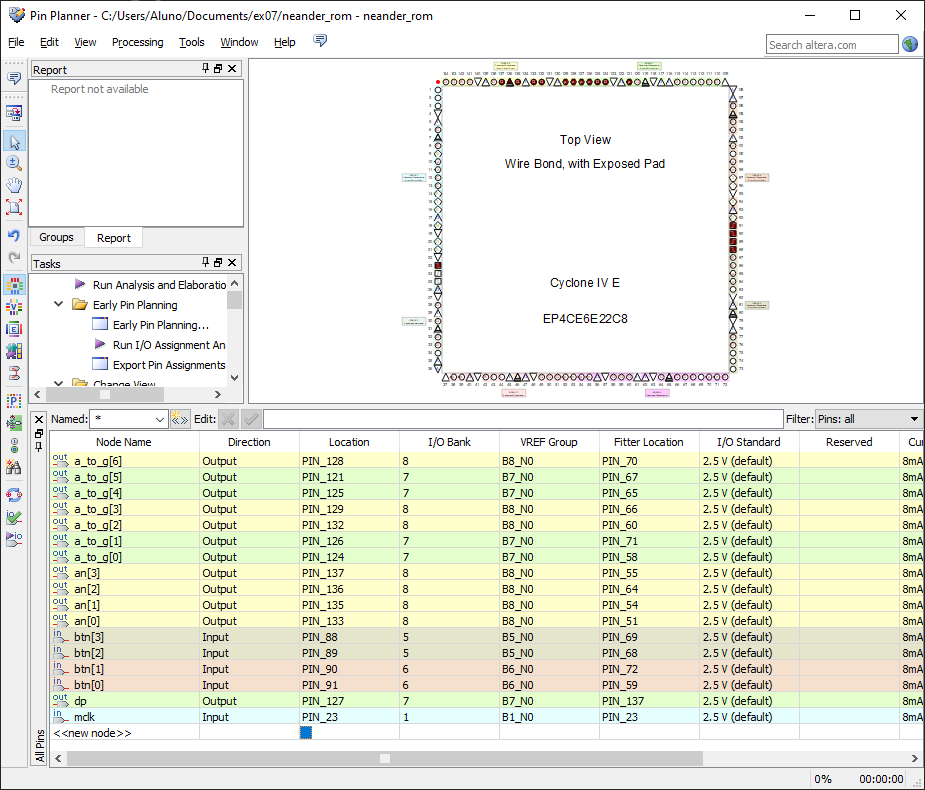

Organização de Computadores, Roteiro da Aula Prática 6, 05 de setembro de 2023.

---

**Sumário**

- [Objetivo da aula](#objetivo-da-aula)
- [Roteiro](#roteiro)
	- [Criar projeto](#criar-projeto)
	- [Arquivo reg\_count\_top](#arquivo-reg_count_top)
	- [Pinos](#pinos)

## Objetivo da aula

Será construído um circuito com base nos componentes já criados nas aulas passadas.

TODO: imagem do circuito

## Roteiro

### Criar projeto

- New project wizard
- Selecione uma pasta .../ex06
- O nome do projeto é: `reg_count_top`
- Selecione os seguintes arquivos .VHD das aulas práticas 2, 3 e 4, disponíveis no site https://sites.google.com/view/fpgacomputer: "clock_pulse" "fulladd" "halfadd" "mux88" "reg" "reg_count" "x7seg" "adder8" "clkdiv" 
- Selecione FPGA Cyclone V, modelo EP4CE6E22C8
- Clique em Next
- Finish

### Arquivo reg_count_top

```VHDL
library IEEE;
use IEEE.std_logic_1164.all;

entity reg_count_top is
	port (
		mclk: in std_logic;
		btn_clk: in std_logic;
		btn_sel: in std_logic;
		a_to_g: out std_logic_vector(6 downto 0);
		an: out std_logic_vector(3 downto 0); -- anodo
		dp: out std_logic -- ponto decimal
	);
end reg_count_top;

architecture structural of reg_count_top is
component clkdiv
port (
	mclk: in std_logic ;
	clr: in std_logic ;
	clk25: out std_logic;
	clk190: out std_logic ;
	clk3: out std_logic ); 
end component;

component clock_pulse
port (
	inp: in std_logic;
	cclk: in std_logic ;
	clr: in std_logic ;
	outp: out std_logic
	);
end component;

component x7seg
port (
	x: in std_logic_vector(15 downto 0);
	clk: in std_logic ;
	clr: in std_logic ;
	a_to_g: out	std_logic_vector (6 downto 0);
	an:     out std_logic_vector (3 downto 0);
	dp: out std_logic 
	);
end component;
                
component reg_count
port ( 
   pc_input: in std_logic_vector (7 downto 0);
	pc_output: out std_logic_vector (7 downto 0);
	incCarga: in std_logic;
	clkPC: in std_logic 
);
end component;

signal nbtn_clk: std_logic;
signal sclk190Hz: std_logic;
signal output_pulse: std_logic;
signal reg_output: std_logic_vector(7 downto 0);

begin
	nbtn_clk <= not btn_clk;
	DIVIDER: clkdiv port map (
		mclk => mclk,
		clr => '0',
		clk190 => sclk190Hz
	);
	CLKPULSE: clock_pulse port map (
		inp => nbtn_clk,
		cclk => sclk190Hz,
		clr => '0',
		outp => output_pulse
	);
	REGCOUNT: reg_count port map (
		pc_input => X"AA",
		pc_output => reg_output,
		incCarga => btn_sel,
		clkPC => output_pulse
	);
	DISP7SEG: x7seg port map (
		x => X"00" & reg_output, -- 00 em hexadecimal concatenado com reg_output
		clk => mclk,
		clr => '0',
		a_to_g => a_to_g,
		an => an,
		dp => dp
	);

end structural;
```

### Pinos

Assignments -> Pin Planner

