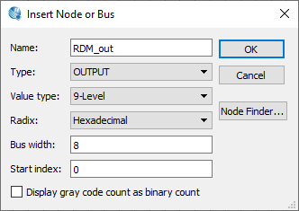
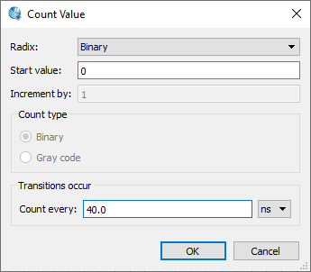
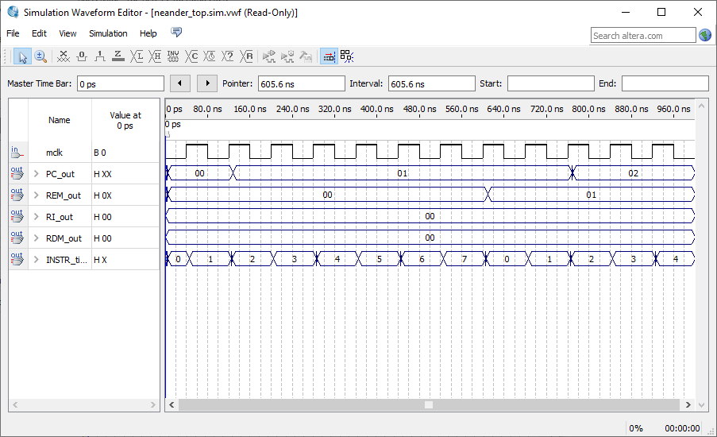
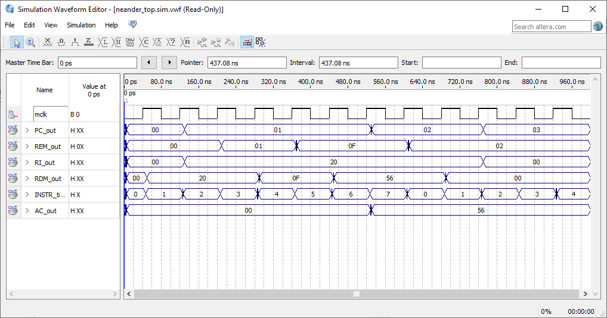

Organização de Computadores, Roteiro da Aula Prática 6, 12 de setembro de 2023.

---

**Sumário**

- [Objetivo da aula](#objetivo-da-aula)
- [Roteiro](#roteiro)
  - [Criar projeto](#criar-projeto)
  - [Simulando o neander](#simulando-o-neander)
  - [Adicionando o comando LDA](#adicionando-o-comando-lda)
    - [carga\_REM](#carga_rem)
    - [sel](#sel)
    - [carga\_RDM](#carga_rdm)
    - [inc\_PC](#inc_pc)
    - [carga\_PC](#carga_pc)
    - [carga\_AC](#carga_ac)
    - [Arquivo final](#arquivo-final)
    - [Arquivo neander\_rom](#arquivo-neander_rom)

## Objetivo da aula

Foi criado o neander top com todos os arquivos criados anteriormente e simulado através do University Program VWF.

TODO: imagem do circuito

## Roteiro

### Criar projeto

- New project wizard
- Selecione uma pasta .../ex7
- O nome do projeto é: `neander_top`
- Todos os arquivos .VHD (exceto `control_unit_backup.vhd`) da aula prática 6, disponíveis no site https://sites.google.com/view/fpgacomputer
- Selecione qualquer FPGA
- Clique em Next
- Finish

Compile o projeto para verificar se tudo deu certo.

Altere a linha `goto_t0 <= '0'` em control_unit.vhd

### Simulando o neander

- Novo arquivo WaveForm
- Insert node or bus
  - mclk, OK
  - PC_out, OUTPUT, Hexadecimal, OK
  - REM_out, OUTPUT, Hexadecimal, OK
  - RDM_out, OUTPUT, Hexadecimal, OK
  - RI_out, OUTPUT, Hexadecimal, OK
  - INSTR_time, OUTPUT, Hexadecimal, OK



Definindo count do mclk para 40.



Salve o arquivo.

Rodar simulação.



### Adicionando o comando LDA

#### carga_REM

Dentro do arquivo control_unit.vhd, procure por `carga_REM <= t(0)` altere a seguinte linha:

`carga_REM <= t(0) or t(3) and instr(iLDA);`

#### sel

Procure por sel <= e altere a seguinte linha:

```MATLAB
sel <= (t(4) and instr(iLDA)) or
		 (t(5) and instr(iLDA));
```

#### carga_RDM

Procure por carga_RDM:

```MATLAB
carga_RDM <= t(1) or
    (t(4) and instr(iLDA)) or;
```

#### inc_PC

Procure o inc_PC:

```MATLAB
inc_PC <= t(1) or 
          t(2) or
			 (t(6) and instr(iLDA)) or
			 (t(7) and instr(iLDA));  
```

#### carga_PC

```MATLAB
carga_PC <= t(2) or
				(t(7) and instr(iLDA));
```

#### carga_AC

```MATLAB
carga_AC <= (t(7) and instr(iLDA));
```

#### Arquivo final

```MATLAB
library IEEE;
use IEEE.std_logic_1164.all;

entity control_unit is
	port (
   instr: in std_logic_vector (15 downto 0);
	N   : in std_logic ;
	Z   : in std_logic ;
	t   : in std_logic_vector (7 downto 0);
	inc_PC: out std_logic ;
	sel : out std_logic ;
	carga_REM: out std_logic ;
	carga_RI: out std_logic ;
	carga_RDM: out std_logic ;
	carga_AC: out std_logic ;
	carga_NZ: out std_logic ;
	carga_PC: out std_logic ;
	s: out std_logic_vector (2 downto 0);
	goto_t0: out std_logic 	
	);
end entity;


architecture control_unit of control_unit is
constant iNOP: integer := 0;
constant iSTA : integer := 1;
constant iLDA: integer := 2;
constant iADD: integer := 3;
constant iOR: integer := 4;
constant iAND:  integer := 5;
constant iNOT: integer := 6;
constant iJMP : integer := 7;
constant iJN:   integer := 8;
constant iJZ:   integer := 9;

begin

carga_REM <= t(0) or 
					(t(3) and instr(iLDA)) or 
						(t(5) and instr(iLDA)) ;				 

carga_RDM <= t(1) or
					(t(4) and instr(iLDA)) or
						(t(6) and instr(iLDA));
            		 
inc_PC <= t(1) or 
          t(2) or
			 (t(6) and instr(iLDA)) or
			 (t(7) and instr(iLDA));  


carga_RI <= t(2);

sel <= (t(4) and instr(iLDA)) or 
			(t(5) and instr(iLDA)) ;	


carga_AC <= (t(7) and instr(iLDA));
			
carga_NZ <= '0';
            

carga_PC <= t(2) 	or
				(t(7) and instr(iLDA));


goto_t0 <= '0';

s(0) <= '0';
s(1) <= '0';
s(2) <= '0';

		   

end control_unit;
```

#### Arquivo neander_rom

Altere a constante rom:

```MATLAB
constant rom: rom_array := (
    iLDA, 
    X"0F",   -- carrega o acumulador com a constante na penultima posicao da ROM
    iNOP, 
    iNOP,   -- soma com o conteúdo da posição 0f   
    iNOP,
    iNOP,   
    iNOP,
    iNOP,   
    iNOP, 
    iNOP,   
    iNOP, 
    iNOP,
    iNOP,	
    iNOP,	
    iNOP,	
    X"56"  
);
```

Simule o waveform novamente:

