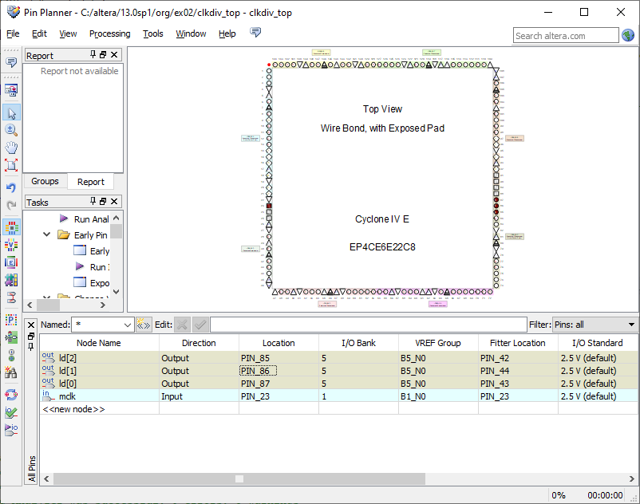
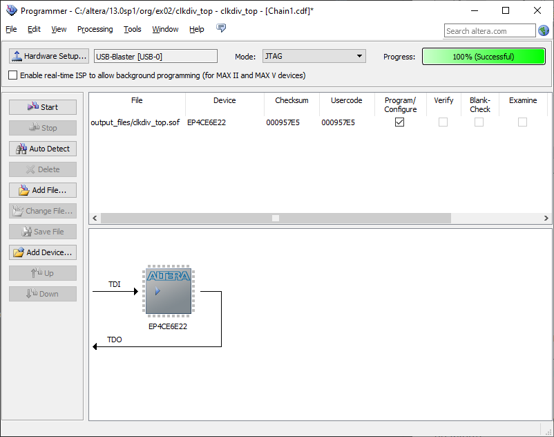

Organização de Computadores, Roteiro da Aula Prática 1, 18 de julho de 2023.

---

**Índice do conteúdo**

- [Roteiro da aula prática](#roteiro-da-aula-prática)
  - [Arquivo `clkdiv.vhd`](#arquivo-clkdivvhd)
    - [Bibliotecas](#bibliotecas)
    - [Entidade](#entidade)
    - [Arquitetura](#arquitetura)
    - [Arquivo final do `clkdiv.vhd`](#arquivo-final-do-clkdivvhd)
  - [Arquivo `clkdiv_top.vhd`](#arquivo-clkdiv_topvhd)
    - [Bibliotecas](#bibliotecas-1)
    - [Entidade](#entidade-1)
    - [Componente](#componente)
    - [Arquitetura](#arquitetura-1)
    - [Arquivo final do `clkdiv_top.vhd`:](#arquivo-final-do-clkdiv_topvhd)
  - [Programando a placa](#programando-a-placa)


Trabalho Prático:
1. Objetivo
2. Materiais e Métodos
3. Procedimento Experimental
4. Resultados e conclusão
5. Bibliografia

Objetivo da aula: fazer os LEDs da placa FPGA piscar

TODO: inserir imagem da estrutura do projeto aqui

## Roteiro da aula prática

- Abrir a IDE Quartus II 64-bit.
- File $\to$ New Project Wizard
    - caminho: documentos/org/ex02
    - arquivo: clkdiv_top
- Next
- Selecionar o FGPA: 
  - Família: Cyclone IV E
  - EP4CE6E22C8
- Next
- Finish

Criar arquivo VHDL: File -> New -> VHDL File

### Arquivo `clkdiv.vhd`

#### Bibliotecas

```VHDL
library IEEE;
use IEEE.std_logic_1164.all;
use IEEE.std_logic_unsigned.all;
```

#### Entidade

```VHDL
entity clkdiv is
	port(
		mclk: in std_logic;
		clr: in std_logic;
		clk1: out std_logic;
		clk2: out std_logic;
		clk3: out std_logic
	);

end clkdiv;
```

#### Arquitetura

```VHDL
architecture clkdiv of clkdiv is 
signal q: std_logic_vector (25 downto 0);

begin
-- divisor de clock
	process(mclk, clr)
	begin
		if(clr = '1') then
			-- "00" concatena (&) com "000000". X indica que é um hexadecimal, formando um sinal de 26 bits
			q <= "00" & X"000000";
			else
				-- se ocorrer evento no master clock e estiver em borda de subida
				if mclk'event and mclk = '1' then 
					q <= q + 1;
				end if;
				
			end if;
			
	end process;
	clk1 <= q(23);
	clk2 <= q(24);
	clk3 <= q(25);
end clkdiv;
```

#### Arquivo final do `clkdiv.vhd`

```VHDL
library IEEE;
use IEEE.std_logic_1164.all;
use IEEE.std_logic_unsigned.all;

entity clkdiv is
	port(
		mclk: in std_logic;
		clr: in std_logic;
		clk1: out std_logic;
		clk2: out std_logic;
		clk3: out std_logic
	);

end clkdiv;

architecture clkdiv of clkdiv is 
signal q: std_logic_vector (25 downto 0);

begin
-- divisor de clock
	process(mclk, clr)
	begin
		if(clr = '1') then
			-- "00" concatena (&) com "000000". X indica que é um hexadecimal, formando um sinal de 26 bits
			q <= "00" & X"000000";
			else
				-- se ocorrer evento no master clock e estiver em borda de subida
				if mclk'event and mclk = '1' then 
					q <= q + 1;
				end if;
				
			end if;
			
	end process;
	clk1 <= q(23);
	clk2 <= q(24);
	clk3 <= q(25);
end clkdiv;
```

Salve o arquivo como `clkdiv`.

TODO: anexar arquivo original .vhdl aqui

### Arquivo `clkdiv_top.vhd`

#### Bibliotecas

```VHDL
library IEEE;
use IEEE.std_logic_1164.all;
use IEEE.std_logic_unsigned.all;
```

#### Entidade

```VHDL
entity clkdiv_top is
	port (
		mclk: in std_logic;
		ld: out std_logic_vector (2 downto 0)
	);
end clkdiv_top;
```

#### Componente

```VHDL
component clkdiv
	port (
		mclk: in std_logic;
		clr: in std_logic;
		clk1: out std_logic;
		clk2: out std_logic;
		clk3: out std_logic
	);
end component;
```

#### Arquitetura

```VHDL
architecture clkdiv_top of clkdiv_top is
component clkdiv
	port (
		mclk: in std_logic;
		clr: in std_logic;
		clk1: out std_logic;
		clk2: out std_logic;
		clk3: out std_logic
	);
end component;

begin
	C1: clkdiv port map (
		mclk => mclk,
		clr => '0',
		clk1 => ld(0),
		clk2 => ld(1),
		clk3 => ld(2)
	);
end clkdiv_top;
```

#### Arquivo final do `clkdiv_top.vhd`:

```VHDL
library IEEE;
use IEEE.std_logic_1164.all;
use IEEE.std_logic_unsigned.all;

entity clkdiv_top is
	port (
		mclk: in std_logic;
		ld: out std_logic_vector (2 downto 0)
	);
end clkdiv_top;

architecture clkdiv_top of clkdiv_top is
component clkdiv
	port (
		mclk: in std_logic;
		clr: in std_logic;
		clk1: out std_logic;
		clk2: out std_logic;
		clk3: out std_logic
	);
end component;

begin
	C1: clkdiv port map (
		mclk => mclk,
		clr => '0',
		clk1 => ld(0),
		clk2 => ld(1),
		clk3 => ld(2)
	);
end clkdiv_top;
```

Salve o arquivo como `clkdiv_top`.

TODO: anexar arquivo original .vhdl aqui

### Programando a placa

TODO: imagem da placa

Assignments -> pin planner



assinalar os pinos:
- ld[2]: PIN_85
- ld[1]: PIN_86
- ld[0]: PIN_87
- mclk: PIN_23

Compilar de novo 

- tools -> programmer
- hardware setup -> USB Blaster
- add file -> /output_file/clkdiv_top.sof
- start



---

Relatório em grupo (Máximo 5 alunos por grupo): fazer contador com divisor de clock, nome da placa OMDAZZ, software da Alterra. 

Prazo de 2 semanas. Nota de relatório entra como nota de trabalho.

Bibliografia: Roberto d'Amore

