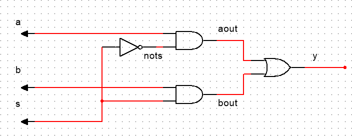
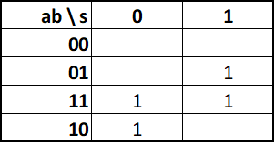

## Multiplexador 2 para 1

### Design Digital



### Mapa-K



$y = \overline{s}a + sb$

### Código VHDL

[Link para o arquivo VHDL](/vhds/mux_2-to-1/mux21.vhd)

```VHDL
library IEEE;
use IEEE.std_logic_1164.all;

entity mux21 is
	port (
		a : in STD_LOGIC;
		b : in STD_LOGIC;
		s : in STD_LOGIC;
		y : out STD_LOGIC
	);
end mux21;

architecture mux21 of mux21 is
	signal aout : STD_LOGIC;
	signal bout : STD_LOGIC;
	signal nots : STD_LOGIC

begin
	aout <= nots and a;
	bout <= s and b;
	nots <= not(s);
	y <= bout or aout;
end mux21;
```